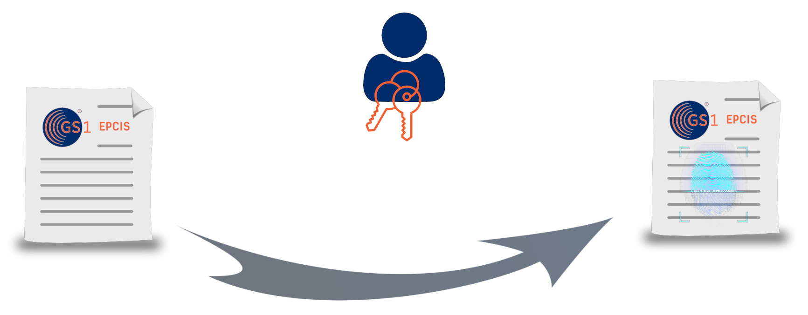

[](https://github.com/COPPA-CCP/epcis-signing/actions)




# EPCIS Signing

Signing of EPCIS event for tracability and immutability within in COPPA and beyond

## General Idea

Signing data on the EPCIS level allows trusted and collaborative data exchange among arbitrary parties. This becomes particulary important when use case crucial data needs to be shared over many participants, e.g. in case of a circular economy, where every stakeholder is dependent on a trustable data flow from its predecessor.  
In order to allow this in a secure and trustful manner, we aim to leverage the self-sovereign identity ecosystem as a public key infrastructure and the adjacent [verifiable credentials](https://ec.europa.eu/digital-building-blocks/wikis/display/EBSI/EBSI+Verifiable+Credentials) for signing data. For more information read the [motivational article](./docs/motivation.md) on this topic.

### Advantages

 - **Immutability** - allows trustless data exchange over an arbitrary amount of stakeholders
  
 - **Traceability** - each information can be tracked back to its producer and makes it authentic

 - **Trust** - identifying each stakeholder and its adjacent data and thereby forms the foundation for an independent trust framework

&#8594; Basis for collaborative data platforms


## Security Considerations

### Anonymity

**Ideas**

 - [A solution approach for the anonymous sharing of
sensitive supply chain traceability data](https://arxiv.org/pdf/2204.00317.pdf)

### Selective Disclosure

Allowing data to flow between arbitrary parties will result in the need disclose only the necessary bits of information within the data to others which is needed. Therefore a a selective disclosure mechanism within the signing process should be envisioned from the start.

**Ideas**

 - [Merkle tree](https://github.com/Echsecutor/NITree)
 - [SD_JWT](https://datatracker.ietf.org/meeting/114/materials/slides-114-oauth-sd-jwt-selective-disclosure-for-jwt-ietf-114-oauth-sd-jwt-00.pdf)


## Verifiable Credential Data Model

### W3C Verifiable Credentials

This data model is based upon the [W3C VC Data Model](https://www.w3.org/TR/vc-data-model/)

**Options**  

  
**a\)**  verifiableCredential.credentialSubject is a EPCISDocument  
 - credentialSubject.id = EPCISDocument.id


```json
{
  "@context": [
    "https://www.w3.org/2018/credentials/v1",
    "https://ssi.eecc.de/api/registry/context",
    "https://w3id.org/security/suites/ed25519-2020/v1"
  ],
  "id": "https://ssi.eecc.de/api/registry/vc/f2c39be7-2bbf-4a97-a3af-b6d5a2a74909",
  "type": [
    "VerifiableCredential"
  ],
  "issuer": {
    "id": "did:web:ssi.eecc.de",
    "image": "https://id.eecc.de/assets/img/logo_big.png",
    "name": "EECC"
  },
  "issuanceDate": "2023-02-13T10:26:07Z",
  "credentialSubject": {
    "@context": [
      "https://ref.gs1.org/standards/epcis/2.0.0/epcis-context.jsonld"
    ],
    // subject id is the EPCIS document id
    "id": "https://id.eecc.de/epcis/document/12345",
    "type": "EPCISDocument",
    "schemaVersion": "2.0",
    // semantic question if this should match the issuance date
    "creationDate": "2023-02-07T11:05:00.0Z",
    "epcisBody": {
      "eventList": [
        {
          "type": "ObjectEvent",
          "eventTime": "2023-02-07T11:04:03.15Z",
          "eventTimeZoneOffset": "+01:00",
          "epcList": [
            "https://id.eecc.de/01/04012345999990/21/XYZ-1234"
          ],
          "action": "OBSERVE",
          "bizStep": "repairing",
          "disposition": "conformant",
          "readPoint": {
            "id": "https://id.eecc.de/414/4012345000115"
          }
        }
      ]
    }
  },
  "proof": {
    "type": "Ed25519Signature2020",
    "created": "2023-02-13T10:26:07Z",
    "verificationMethod": "did:web:ssi.eecc.de#z6MkoHWsmSZnHisAxnVdokYHnXaVqWFZ4H33FnNg13zyymxd",
    "proofPurpose": "assertionMethod",
    "proofValue": "z43q6v4ejP9uAZkX8tjjWeH3W6raHKRH2fXRLuN51YMprpTwE8331EaL5jfRcNQNV9bLxVVEpT8gfMsU2iA2A5bMh"
  }
}
```

**b\)** verifiableCredential.credentialSubjcet is a EPCISEvent
  - credentialSubjcet.id = EPCISEvent.id

```json
{
  "@context": [
    "https://www.w3.org/2018/credentials/v1",
    "https://ssi.eecc.de/api/registry/context",
    "https://w3id.org/security/suites/ed25519-2020/v1"
  ],
  "id": "https://ssi.eecc.de/api/registry/vc/1f8ffded-3a7a-41db-86ea-225949a25023",
  "type": [
    "VerifiableCredential"
  ],
  "issuer": {
    "id": "did:web:ssi.eecc.de",
    "image": "https://id.eecc.de/assets/img/logo_big.png",
    "name": "EECC"
  },
  "issuanceDate": "2023-02-13T10:35:32Z",
  "credentialSubject": {
    "@context": [
      "https://ref.gs1.org/standards/epcis/2.0.0/epcis-context.jsonld"
    ],
    // event id equals subject id
    "id": "https://id.eecc.de/epcis/event/12345",
    "type": "ObjectEvent",
    "eventTime": "2023-02-07T11:04:03.15Z",
    "eventTimeZoneOffset": "+01:00",
    "epcList": [
      "https://id.eecc.de/01/04012345999990/21/XYZ-1234"
    ],
    "action": "OBSERVE",
    "bizStep": "repairing",
    "disposition": "conformant",
    "readPoint": {
      "id": "https://id.eecc.de/414/4012345000115"
    }
  },
  "proof": {
    "type": "Ed25519Signature2020",
    "created": "2023-02-13T10:35:32Z",
    "verificationMethod": "did:web:ssi.eecc.de#z6MkoHWsmSZnHisAxnVdokYHnXaVqWFZ4H33FnNg13zyymxd",
    "proofPurpose": "assertionMethod",
    "proofValue": "zkdjpZBbPa81HCD4GpCLgwSRJ75MPZFDzZdvUdLBkhFNkDEdVcXB12Q14GrmSqS82WoifY75MUMG8TuXpPMN1Frb"
  }
}
```

### SD-JWT

tbd.


## Examples

### Sign EPCIS Event

Install the npm package

```
npm i epcis-signing
```

Generate a kay pair and sign a demo event

```ts
import { EPCISEvent, VerifiableCredential, sign } from 'epcis-signing';
// @ts-ignore
import { Ed25519VerificationKey2020 } from '@digitalbazaar/ed25519-verification-key-2020';

const epcisEvent: EPCISEvent = {
    "@context": [
        "https://ref.gs1.org/standards/epcis/2.0.0/epcis-context.jsonld"
    ],
    "type": "ObjectEvent",
    "id": 'https://testid.com/epcis/event/12345',
    "eventTime": "2023-02-07T11:04:03.15Z",
    "eventTimeZoneOffset": "+01:00",
    "epcList": [
        "https://id.eecc.de/01/04012345999990/21/XYZ-1234"
    ],
    "action": "OBSERVE",
    "bizStep": "repairing",
    "disposition": "conformant",
    "readPoint": {
        "id": "https://id.eecc.de/414/4012345000115"
    }
}

async function getKeyPair(): Promise<Ed25519VerificationKey2020> {

    // generate the keyPair from seed
    let keyPair = await Ed25519VerificationKey2020.generate();

    // name the keyPair in order to make it resolvable
    keyPair.id = 'did:key:' + keyPair.publicKeyMultibase + '#' + keyPair.publicKeyMultibase;
    keyPair.controller = 'did:key:' + keyPair.publicKeyMultibase;

    return keyPair;

}

async function signEvent(): Promise<VerifiableCredential> {

    const keyPair: Ed25519VerificationKey2020 = await getKeyPair();

    return await sign(epcisEvent, keyPair, 'https://test.com/vc/12345')

}

signEvent()
    .then((signedCred: VerifiableCredential) => {
        console.log(signedCred)
    });
```

### Verify Signed Events

For verifiaction of EPCIS credentials you can use the EECC VC Verifier as a [Web App](https://ssi.eecc.de/verifier/) or [API](https://ssi.eecc.de/api/verifier/swagger/).

